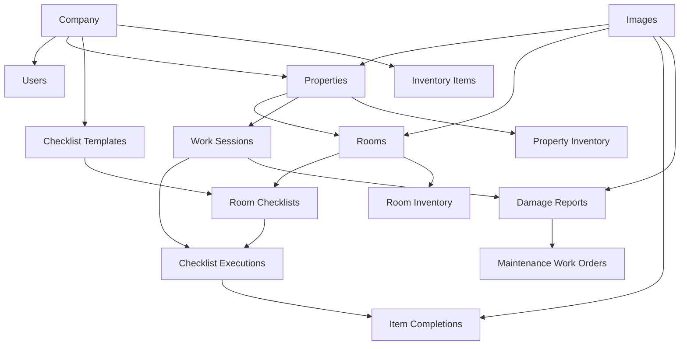

# Platform Overview

## What Turndown Is

Turndown is an operations platform for short-term rental businesses.

At its core, it helps a company answer five questions:

1. **What places do we manage?**
2. **What should be done in each place?**
3. **Who is doing the work?**
4. **Was the work actually completed?**
5. **What problems or supply issues need follow-up?**

## The Core Promise

Turndown brings structure to turnover work that usually lives in text messages, memory, spreadsheets, and scattered photos.

For property managers, the value is control and visibility.  
For cleaners and maintenance workers, the value is speed and clarity.

## The Product in One Sentence

A manager sets up properties, rooms, access details, checklists, and teams.  
A worker receives work, completes room-by-room tasks, records proof, flags issues, and updates supply levels.

## Main Product Areas

### 1. Organization and Access
The platform starts with companies and users. A company can represent a property management business, a cleaning business, a maintenance provider, or another service business.

### 2. Property Setup
Each company can store one or more properties. Each property can contain rooms, access details, notes, and media.

### 3. Standards and Checklists
A company can define reusable checklist templates. Those templates can be attached to rooms and then customized at the room level.

### 4. Work Execution
A work session represents an actual visit to a property. During a session, the worker completes checklist items room by room.

### 5. Supplies and Inventory
The system tracks inventory items, current levels, restock thresholds, and historical counts.

### 6. Issues and Maintenance
If something is damaged or needs work, it can be reported, discussed, assigned, and turned into a maintenance work order.

### 7. Proof and History
Photos, notes, timestamps, comments, and status history provide accountability and context.

## Primary User Modes

## Property Manager Mode
This side of the product is more administrative and information-dense. It includes:

- company and team setup
- property creation and organization
- room standards and checklist design
- monitoring work sessions
- reviewing issues and maintenance
- tracking supplies and exceptions

## Cleaner / Maintenance Mode
This side of the product should feel lighter and more task-driven. It includes:

- seeing assigned work
- opening a property
- following room-level instructions
- completing checklist items
- taking required photos
- flagging damage or supply problems
- finishing a session cleanly

## Platform Structure

## What “Done” Looks Like in This Product

A typical successful use of Turndown looks like this:

- a company is created
- team members are invited
- a property is added
- rooms are defined
- each room gets a checklist
- a worker visits the property
- tasks are completed and documented
- supply levels are updated
- any issue is reported before the worker leaves
- the manager has a clear record of what happened

## Product Principles the App Should Support

These principles are already implied by the current system model:

### Managers need context
Managers need to see the whole picture: people, places, standards, work, supply health, and open issues.

### Workers need momentum
Workers should not dig through menus to do a job. They should be able to move from property → room → task → proof with as little friction as possible.

### Rooms matter
Turndown is not only property-based. It is strongly room-based. Standards, inventory, issues, and execution all become more useful when they are tied to a room.

### Photos are part of the product, not an extra
Photo proof shows up in multiple places and should be treated as a core interaction pattern.

### Relationships matter
A property company may work with outside cleaning or maintenance companies. The product already models that relationship explicitly.
