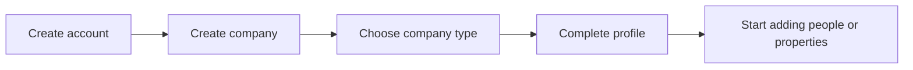
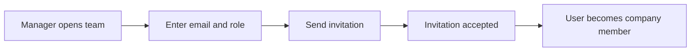
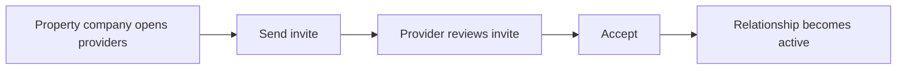
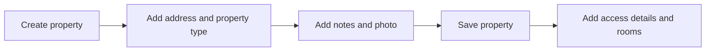
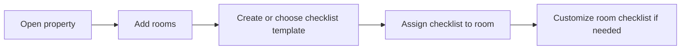
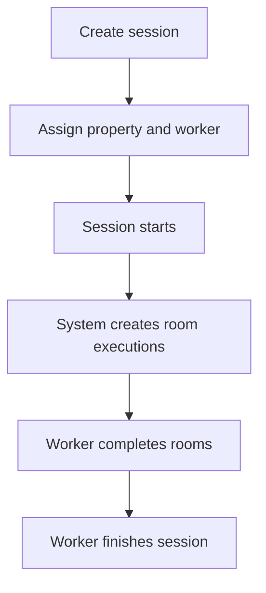
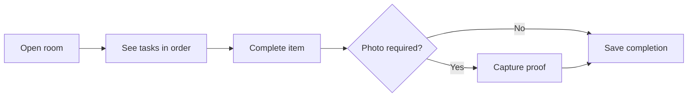
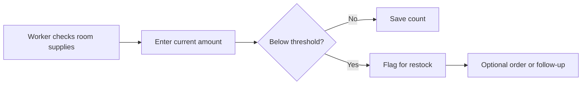
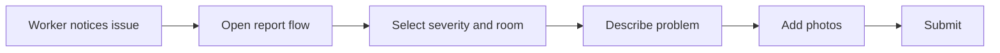
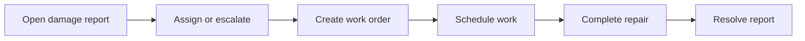

# Core Workflows

This section describes the main product journeys.

## 1. Create a Company and First User

### Outcome
The business now has a home inside Turndown.

### Key records created
- user
- company
- membership between user and company

---

## 2. Invite a Team Member

### Outcome
A person gains access to the company with a defined role.

### Important experience details
- invitation should clearly show company name
- role should be obvious before acceptance
- pending, accepted, expired, and revoked should be visually distinct

---

## 3. Invite a Service Provider Company

### Outcome
Two companies become linked for service work.

### Important experience details
- “my team” and “outside provider” must not be mixed together
- pending invites and active relationships should be separate sections
- this flow is business-to-business, not person-to-person

---

## 4. Add a Property

### Outcome
A property exists and is ready for room setup.

### Important experience details
- access details are part of setup, but often feel like their own step
- property photo is helpful but not always required
- special notes should be treated as important, not an afterthought

---

## 5. Add Rooms and Define Standards

### Outcome
Each room has an actionable standard.

### Important experience details
- a template is reusable
- a room checklist is the version that actually governs work in that room
- one room should only have one active checklist at a time

---

## 6. Create and Run a Work Session

### Outcome
A real job is tracked from scheduled state to completion.

### Important experience details
- the worker should see a simple top-down path
- room progress should always be visible
- time data should feel automatic, not manually burdensome

---

## 7. Complete Checklist Items

### Outcome
The room’s work is documented item by item.

### Important experience details
- photo-required items need stronger visual emphasis
- skipped items should require explanation
- once an item is done, its state should be obvious and durable

---

## 8. Count or Restock Supplies

### Outcome
Supply levels stay current and low-stock issues become visible.

### Important experience details
- current amount, target amount, and low threshold must not be visually confused
- consumables and fixed items may need different interaction patterns
- low-stock alerts should be easy for managers to scan

---

## 9. Report Damage

### Outcome
The issue becomes a trackable problem instead of a forgotten text message.

### Important experience details
- severity should be chosen carefully
- room and location details matter
- before and after photos should be supported over time

---

## 10. Turn Damage Into Maintenance Work

### Outcome
The platform connects discovery to action.

### Important experience details
- not every damage report becomes a work order
- the relationship between report and work order should remain visible
- status changes need a sense of timeline and accountability

## End-to-End Example

A realistic full lifecycle looks like this:

1. A property manager creates a property.  
2. The manager adds rooms and standards.  
3. A cleaning company relationship is active.  
4. A worker is assigned to a work session.  
5. The worker completes room tasks and required photo proof.  
6. The worker notices low stock in the bathroom and updates the count.  
7. The worker finds a broken towel bar and submits a damage report.  
8. The manager reviews the issue and creates a maintenance work order.  
9. The property now has a complete operational record for that visit.

That is the product’s sweet spot.
